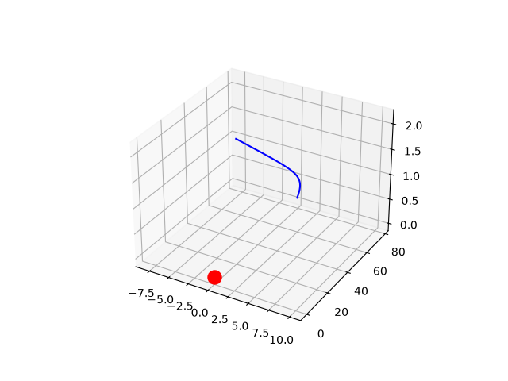

# Higher-Dimensional Gravity Simulation

A Python-based simulator designed to model and visualize orbits in 4D+ spatial dimensions inspired by string theory.

# Theoretical Working

In a 3-D universe, gravity follows an inverse-square law. However, applying Gauss's Law to a generalized nth-dimensional universe means that the gravitational force spreads over the hypersphere (n-sphere) surface area.

The generalized gravitational acceleration vector is modeled with this equation: 
$$ \vec{a} = -G \frac{M}{r^N} \ vec{r} $$. 

For this 4D simulation, gravity scales with an inverse-cube law ($1/r^3$). Because 4+ dimensions create mathematically unstable orbits, this project will visually demonstrate why extra dimensions must be simplified and compacted to sustain stable solar systems and matter.

# Trajectory Analysis and Visual Results

The simulator uses physics across 4D axes and projects the trajectory data into a 3D coordinate frame so it can be visualized.

The particle experiences a sharp trajectory close to the central mass before breaking free into a straight-line path. Shown below.

# Experimenting with Parameters 

You can modify the initial conditions to observe different astrophysical behaviors.

The Crash Scenario: Change the velocity vector to 'vel = np.array([0.0, 3.5, 0.0, 0.0])'. Because 4D gravity drops off as $1/r^3$, lowering speed parameters allow gravity to trap the planet in a tight spiral crash into the star.

Have fun!

